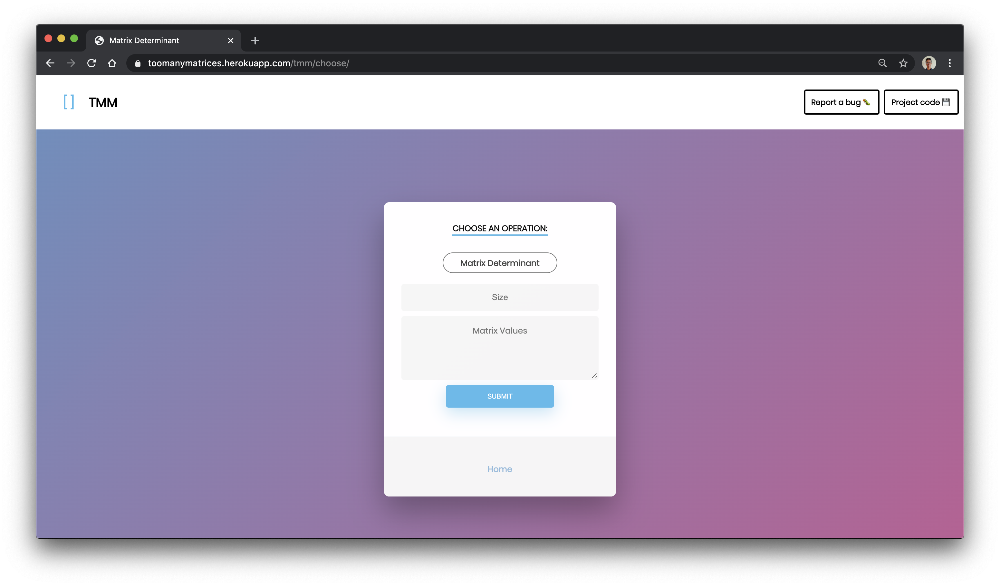

# TooManyMatrices

Have you ever looked at a particularly gnarly math problem and thought, "there is _no way_ I can manually calculate _that_ without messing up"? If you have, then `TooManyMatrices` might ease your woes (your matrix woes anyway) by running those calculations for you.

`TooManyMatrices` is a project where we ([@AdiUA](https://github.com/Adi-UA) and [@dev-ved30](https://github.com/dev-ved30)) build a website to solve matrix problems that are annoying to compute by hand or calculator.

[Click here to go to the website](https://toomanymatrices.herokuapp.com/) or copy paste the following URL in your browser: https://toomanymatrices.herokuapp.com/

**Credit:** Huge shoutout to [Daniel Zawadzki](https://codepen.io/danzawadzki/pens/showcase) whose form we found in a free CSS list on `templatemonster.com`

## Using Locally

### Before Running (Assuming you have pip and git)

* Run `pip install wheel`
* Run `pip install django`
* Run `pip install numpy`
* Run `pip install whitenoise`

Then, clone the repo with: `git clone https://github.com/Adi-UA/TooManyMatrices.git` or use the latest stable `release`.

**Note:** We are using `python 3.7.4`, `wheel 0.34.2`, `django 3.0.7`, `numpy 1.18.4`, and `whitenoise 5.1.0`

### Running

From inside the repo on your computer, go to `src`, open a `terminal` and run:

`python manage.py collectstatic`

`python manage.py runserver`

**Note:** This command works as is on `CMD`, and can work as is in a `Bash` environment if you have your `python3` alias set to `python`.

Finally, open a browser and go to `localhost:8000` to get started.

**Note:** The website itself should work within any browser, but you might see some UI inconsistencies on non-Chromium based browsers (Ex. Safari).

## Found Bugs?
We would appreciate any support in the form of bug reports, both mathemtaical and user interface based in order to provide the best possible experience. Bugs can be reported in the `Issues` tab.

### Supported Opertaions

We currently support:
* Matrix Addition
* Matrix Subtraction
* Matrix Product
* Matrix Bitwise AND, OR, XOR
* Matrix Power
* Matrix Right and Left Shift
* Matrix Transpose
* Matrix Boolean Power
* Matrix Boolean Product
* Matrix Cofactor
* Matrix Adjoint
* Matrix Minor
* Matrix Inverse
* Determinant
